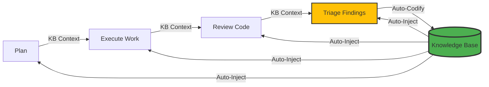

# Compounding Engineering (DSPy Edition)


A Python implementation of the [Compounding Engineering Plugin](https://github.com/EveryInc/compounding-engineering-plugin) using [DSPy](https://github.com/stanfordnlp/dspy).

[**📚 Documentation**](https://strategic-automation.github.io/dspy-compounding-engineering/)

## What Is Compounding Engineering?

**Each unit of engineering work should make subsequent units of work easier—not harder.**

This CLI tool provides AI-powered development tools for code review, planning, and workflow automation, following the compounding engineering philosophy. It is designed as a **Local-First** tool that runs on your machine, keeping your code secure while leveraging powerful LLMs.

## Features

- **🧠 Compounding Engineering**: True learning system where every operation makes the next one easier

  - **Auto-Learning**: Every todo resolution automatically codifies learnings
  - **KB Auto-Injection**: Past learnings automatically inform all AI operations
  - **Pattern Recognition**: Similar issues are prevented based on past resolutions
  - **Knowledge Accumulation**: System gets smarter with every use

- **🔍 Multi-Agent Code Review**: Run 10+ specialized review agents in parallel

  - **Security Sentinel**: Detects vulnerabilities (SQLi, XSS, etc.)
  - **Performance Oracle**: Identifies bottlenecks and O(n) issues
  - **Architecture Strategist**: Reviews design patterns and SOLID principles
  - **Data Integrity Guardian**: Checks transaction safety and validation
  - **KB-Augmented**: All agents benefit from past code review learnings
  - And many more...

- **🤖 ReAct File Editing**: Intelligent file operations with reasoning

  - **Smart Context Gathering**: Relevance-scored file selection and token budget management
  - **Iterative Reasoning**: Think → Act → Observe → Iterate pattern
  - **Zero Hallucination**: Direct file manipulation, not text generation

- **🛡️ Secure Work Execution**: Safely execute AI-generated plans

  - **Isolated Worktrees**: High-level isolation for safe parallel execution via `--worktree`
  - **Parallel Processing**: Multi-threaded todo resolution with `--workers`
  - **Auto-Codification**: Every resolution creates learnings for future use

- **📋 Smart Planning**: Transform feature descriptions into detailed plans

  - Repository research & pattern analysis
  - **🌐 Internet Search**: Access live sources and current standards
  - **Documentation Fetcher**: Deep-read official documentation from URLs
  - SpecFlow user journey analysis
  - **KB-Informed**: Plans leverage past architectural decisions

- **✅ Interactive Triage**: Manage code review findings
  - **Batch Operations**: Approve multiple findings at once
  - **Smart Priorities**: Auto-detection of P1/P2/P3 severity
  - **Work Logs**: Tracks decisions and rationale automatically
  - **KB-Augmented**: Triage decisions informed by past patterns

## Installation

### The One-Liner (Recommended)

To install the `compounding` CLI securely and quickly on any machine, use our installer script. This will download `uv`, fetch the CLI, lock it to a known-good Python version (3.12), and place it in an isolated environment that avoids dependency conflicts.

```bash
curl -LsSf https://raw.githubusercontent.com/Strategic-Automation/dspy-compounding-engineering/main/scripts/install.sh | sh
```

### Via Pip (For standard Python setups)

If you prefer using `pip`, you can install our lightweight wrapper which will bootstrap the `uv` environment under the hood:

```bash
pip install dspyce-install
dspyce-install
```

### For Contributors (Source Installation)

```bash
# Clone repository
git clone https://github.com/Strategic-Automation/dspy-compounding-engineering.git
cd dspy-compounding-engineering

# Configure environment
cp .env.example .env

# Install dependencies and sync environment
uv sync

# Install Playwright browsers (Required for high-fidelity documentation fetching)
uv run playwright install chromium
```

### Vector Database Setup (Qdrant)

This project uses [Qdrant](https://qdrant.tech/) for semantic search. A Docker Compose configuration is provided.

1. **Start Qdrant**:

   ```bash
   docker compose up -d qdrant
   ```

   This will start Qdrant on `localhost:6333`.

2. **Configure Embeddings**:
   Ensure your `.env` has the correct `EMBEDDING_BASE_URL` if you are using a non-standard provider (like OpenRouter). See `.env.example`.

> **Note:** If Qdrant is not running, the system will automatically fall back to keyword-based search using local JSON files.

### Temporary runner: `uvx`

The repository includes a small wrapper script `uvx` that runs the CLI via `uv run` without doing a global install. It's useful for quickly trying commands locally:

```bash
./uvx -h
./uvx generate-agent "create an agent to check for hardcoded secrets"
```

The script is in the repository root and is executable; run it from the repo directory.

You can also prefix commands with `compounding`, for example `./uvx compounding generate-agent`.

## Example run

Quick example using the temporary runner `uvx` to see the `generate-agent` help:

```bash
./uvx generate-agent -h
```

Expected excerpt:

```
Usage: compounding generate-agent [OPTIONS] DESCRIPTION

Generate a new Review Agent from a natural language description.

Options:
  --dry-run  -n   Show what would be created without writing files
  --help     -h   Show this message and exit.
```

You can run other commands similarly, for example:

```bash
./uvx -h
./uvx review --project
./uvx work p1 --env-file test.env
```

## Global Options

The tool supports several global options that can be used with any command:

- `-e, --env-file PATH`: Explicitly specify a `.env` file to load.
- `-h, --help`: Show help for any command.

## Configuration Priority

The tool loads configuration from multiple sources in the following priority order:

1. **Explicit Flag**: `--env-file` / `-e` on the command line.
2. **Environment Variable**: `COMPOUNDING_ENV` pointing to a `.env` file path.
3. **Local Override**: `.env` in the current working directory (CWD).
4. **Tool-Specific Global**: `~/.config/compounding/.env`.
5. **System Fallback**: `~/.env` in the user's home directory.

> [!TIP]
> This priority allows you to have a global `~/.config/compounding/.env` with your API keys while using local `.env` files for project-specific model selections.

## The Compounding Engineering Loop

This implementation embodies the core philosophy: **each unit of work makes subsequent work easier**.



**How it works:**

1. **Auto-Injection**: All AI operations (`review`, `triage`, `plan`, `work`) automatically receive relevant past learnings
2. **Auto-Codification**: Every todo resolution automatically extracts and stores learnings
3. **Pattern Recognition**: The system identifies similar issues and suggests solutions based on past successes
4. **Continuous Improvement**: The more you use it, the smarter it gets

### Knowledge Base Features

- **Persistent Learning**: Learnings stored in `.knowledge/` as structured JSON
- **Smart Retrieval**: Keyword-based similarity matching (extensible to vector embeddings)
- **Auto-Documentation**: `AI.md` automatically updated with consolidated learnings
- **Tagged Search**: Filter learnings by category, source, or topic

### Roadmap

See our [detailed Roadmap](https://strategic-automation.github.io/dspy-compounding-engineering/roadmap/) for upcoming features.

Key focus areas:

- **GitHub Integration**: Create Issues, post PR comments, manage Projects (Partially Completed)
- **Vector Embeddings**: Upgrade from keyword matching to semantic similarity (Completed)
- **Smart Context**: Intelligent relevance-scored gathering (Completed)
- **Learning Analytics**: Dashboard showing knowledge growth and reuse

## Configuration

Edit `.env` to configure your LLM provider:

```bash
# OpenAI
DSPY_LM_PROVIDER=openai
DSPY_LM_MODEL=gpt-5.1-codex
OPENAI_API_KEY=sk-...

# Anthropic
DSPY_LM_PROVIDER=anthropic
DSPY_LM_MODEL=claude-4-5-haiku
ANTHROPIC_API_KEY=sk-ant-...

# Ollama (Local)
DSPY_LM_PROVIDER=ollama
DSPY_LM_MODEL=qwen3

# OpenRouter (Multi-Model Access)
DSPY_LM_PROVIDER=openrouter
DSPY_LM_MODEL=x-ai/grok-4.1-fast:free
OPENROUTER_API_KEY=sk-or-...

# Context Limits (Optional)
CONTEXT_WINDOW_LIMIT=128000
CONTEXT_OUTPUT_RESERVE=4096
DOCS_MAX_TOKENS=32768  # Limit for documentation fetching (default: 32k)
```

## MCP Server Integration (Claude Desktop)

`compounding` can be attached to any Model Context Protocol (MCP) client, such as Claude Desktop, to expose its capabilities as native tools to the assistant.

To configure Claude Desktop to use the DSPy Compounding Engineering FastMCP server:

1. Open your Claude Desktop configuration file (typically at `~/Library/Application Support/Claude/claude_desktop_config.json` on macOS).
2. Add the following to the `mcpServers` section:

```json
{
  "mcpServers": {
    "dspy-compounding": {
      "command": "uvx",
      "args": ["compounding-mcp"]
    }
  }
}
```

3. Restart Claude Desktop. The agent will now have access to `compounding_review`, `compounding_plan`, `compounding_work`, `compounding_triage`, and `compounding_sync` directly from your chat!

## Multi-Source Configuration

As a tool meant to be used across multiple repositories, configuration can be managed at different levels:

- **Global**: Store your API keys in `~/.config/compounding/.env` so they are available everywhere.
- **Local**: Add a `.env` in your project root to override models or settings for that specific project.
- **On-the-fly**: Use `--env-file path/to/.env` to quickly switch between different environments (e.g., testing vs. production models).

The tool will warn you if multiple conflicting configuration files are detected.

## Usage

> [!TIP]
> If you have installed the tool via `uv tool install --from .`, you can use the `compounding` command directly. Otherwise, use `uv run python cli.py`.

### 1. Review Code

Run a comprehensive multi-agent review on your current changes or a specific PR:

```bash
# Review latest local changes
compounding review

# Review a specific PR ID
compounding review 86

# Review a specific branch
compounding review dev

# Review a full PR URL (requires gh cli)
compounding review https://github.com/user/repo/pull/123

# Review entire project (not just changes)
compounding review --project
```

> **Note:** The review process automatically ignores lock files (e.g., `uv.lock`, `package-lock.json`) and standard binary/cache directories to reduce noise.

### 2. Triage Findings

Process the findings generated by the review:

```bash
compounding triage
```

- **Yes**: Approve and convert to ready todo
- **Next**: Skip or delete
- **All**: Batch approve all remaining items
- **Custom**: Change priority or details

### 3. Work on Todos or Plans

Unified command for resolving todos or executing plans using ReAct agents:

```bash
# Resolve all P1 priority todos
compounding work p1

# Resolve specific todo by ID
compounding work 001

# Execute a plan file
compounding work plans/feature.md

# Preview changes without applying (dry run)
compounding work p1 --dry-run

# Use isolated worktree (safe parallel execution)
compounding work p1 --worktree

# Control parallelization
compounding work p2 --sequential  # Sequential execution
compounding work p2 --workers 5   # 5 parallel workers
```

This will:

1. Auto-detect input type (todo ID, plan file, or pattern)
2. Use ReAct reasoning for intelligent file operations
3. Execute in-place (default) or in isolated worktree (`--worktree`)
4. Process todos in parallel (default) or sequentially (`--sequential`)
5. Mark todos as complete (`*-complete-*.md`)
6. Clean up worktrees automatically

### 4. Generate Agents

Generate new review agents from natural language descriptions:

```bash
# Generate a new agent
compounding generate-agent "Check for SQL injection vulnerabilities"

# Preview without creating files
compounding generate-agent "Ensure all Python functions have docstrings" --dry-run
```

### 5. Plan New Features

Generate a detailed implementation plan from a description or GitHub issue:

```bash
# Plan from a natural language description
compounding plan "Add user authentication with OAuth"

# Plan from a GitHub issue (ID or URL)
compounding plan 30
compounding plan https://github.com/user/repo/issues/30
```

### 6. Codify Learnings

Capture and codify learnings into the knowledge base:

```bash
compounding codify "Always validate user input before database operations"
compounding codify "Use factory pattern for agent creation" --source retro
```

## Architecture

The system is built on a layered architecture designed for modularity and compounding intelligence:

### 1. Interface Layer (CLI)

- **Entry Point**: `cli.py` uses `Typer` to provide a robust command-line interface.
- **Commands**: Maps user intents (e.g., `review`, `work`) to specific workflows.

### 2. Orchestration Layer (Workflows)

- **Logic**: Python scripts in `workflows/` orchestrate complex multi-step processes.
- **Responsibility**: Manages state, handles user interaction, and coordinates agents.
- **Key Workflows**:
  - **Unified Work**: Combines planning and execution using ReAct loops.
  - **Review Pipeline**: Parallelizes multiple specialized review agents.
  - **Triage System**: Manages findings and prioritizes work.

### 3. Intelligence Layer (DSPy Agents)

- **Signatures**: Declarative definitions of AI tasks in `agents/`.
- **Modules**: `dspy.Module` implementations that chain thoughts and actions.
- **Optimization**: Agents are optimized via DSPy teleprompters.

### 4. Knowledge Layer (Compounding Engine)

- **Storage**: JSON-based knowledge base in `.knowledge/`.
- **Retrieval**: `KBPredict` wrapper automatically injects relevant context into agent calls.
- **Learning**: `LearningExtractor` codifies outcomes from every task into reusable patterns.

### 5. Infrastructure Layer (Utilities)

- **Git Service**: Manages isolated worktrees for safe execution.
- **Project Context**: Efficiently gathers and token-limits codebase context.
- **Todo Service**: Standardizes the unit of work (Markdown-based todos).

## Philosophy

Based on the [Compounding Engineering](https://every.to/source-code/my-ai-had-already-fixed-the-code-before-i-saw-it) philosophy:

- **Plan → Delegate → Assess → Codify** (fully implemented)
- **Each unit of work makes subsequent work easier** (via KB auto-injection)
- **Systematic beats heroic** (automated learning and reuse)
- **Quality compounds over time** (system gets smarter with use)
- **Knowledge is automatically codified** (not optional)

## Comparison with Original Plugin

| Feature          | Original Plugin    | This DSPy Edition                 |
| ---------------- | ------------------ | --------------------------------- |
| **Runtime**      | Claude Code Plugin | Standalone Python CLI             |
| **LLM**          | Claude Only        | OpenAI, Anthropic, Ollama         |
| **Execution**    | Direct File Edit   | **Secure Git Worktrees**          |
| **Integration**  | GitHub App         | Local-First CLI                   |
| **Learning**     | Manual CLAUDE.md   | **Automatic KB Injection**        |
| **Codification** | Manual             | **Automatic on every resolution** |

## Contributing

We welcome contributions! If you're looking for ways to help, please check out our [Issues on GitHub](https://github.com/Strategic-Automation/dspy-compounding-engineering/issues).

See [CONTRIBUTING.md](CONTRIBUTING.md) for detailed guidelines.

## License

MIT

## Credits

Original concept by [Kieran Klaassen](https://github.com/kieranklaassen) at [Every.to](https://every.to).
DSPy framework by [Stanford NLP Group](https://github.com/stanfordnlp/dspy).
