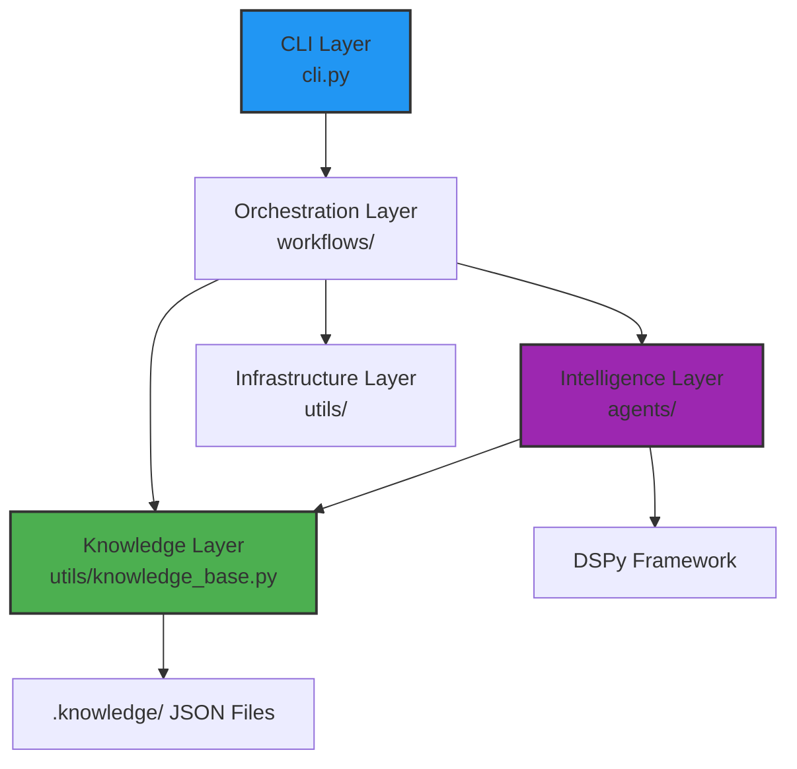
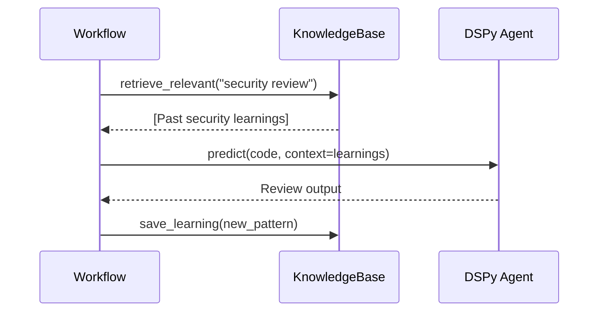
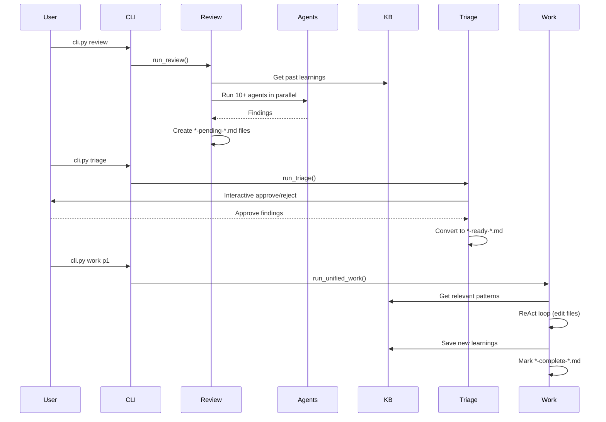

# Architecture

The Compounding Engineering system follows a layered architecture designed to maximize modularity, testability, and the **compounding effect** of accumulated knowledge.

## System Layers



## 1. CLI Layer

**Purpose**: User-facing interface.

**Implementation**: `cli.py` using the `typer` library.

**Commands**:
- `review`: Multi-agent code review
- `triage`: Interactive findings management
- `work`: Unified todo/plan execution
- `plan`: Feature planning
- `codify`: Explicit learning capture

## 2. Orchestration Layer (Workflows)

**Purpose**: Complex multi-step process coordination.

**Location**: `workflows/`

**Key Workflows**:
- **`review.py`**: Parallelizes 10+ review agents, collects findings, creates todos
- **`triage.py`**: Interactive UI for approving/rejecting findings
- **`work_unified.py`**: ReAct-based execution engine with parallel support
- **`plan.py`**: Repository research and plan generation
- **`codify.py`**: Manual knowledge injection

**Responsibilities**:
- State management (files, branches, worktrees)
- User interaction (prompts, progress bars)
- Agent coordination
- Error handling and retry logic

## 3. Intelligence Layer (Agents)

**Purpose**: AI-powered task execution using DSPy.

**Location**: `agents/`

**Structure**:
- `workflow/`: Task execution agents (ReAct, Planning, Editing)
- `review/`: Specialized review agents (Security, Performance, etc.)
- `research/`: Repository analysis agents

**DSPy Integration**:
- **Signatures**: Define input/output contracts (e.g., `GeneratePlan`, `ReviewCode`)
- **Modules**: Chain multiple signatures with reasoning
- **KBPredict Wrapper**: Automatically injects Knowledge Base context

## 4. Knowledge Layer

**Purpose**: The compounding engine.

**Components**:
- **Storage**: `.knowledge/` directory with JSON files
- **Retrieval**: `KnowledgeBase.retrieve_relevant()` for keyword/tag matching
- **Injection**: `KBPredict` wrapper that augments all agent calls
- **Codification**: `LearningExtractor` automatically captures patterns from work sessions

**Auto-Injection Flow**:


## 5. Infrastructure Layer (Utils)

**Purpose**: Cross-cutting concerns.

**Components**:
- **`git_service.py`**: Git operations, worktree management
- **`project_context.py`**: Codebase file gathering
- **`todo_service.py`**: Todo file CRUD
- **`file_tools.py`**: Safe file I/O with backups
- **`kb_module.py`**: DSPy integration for KB

## Key Design Patterns

### 1. ReAct Loop (Reasoning + Acting)
Agents follow a **Think → Act → Observe** cycle:
- **Think**: Generate reasoning about what to do next
- **Act**: Use a tool (search, read, edit)
- **Observe**: Process the result and decide next step

### 2. KB Auto-Injection
Every DSPy prediction automatically receives relevant context from past learnings:
```python
# In workflows/work_unified.py
kb_context = kb.retrieve_relevant(query=f"todo resolution: {task_description}")
result = agent.predict(task=task, context=kb_context)
```

### 3. Worktree Isolation
For safe parallel execution:
```python
worktree_path = f"worktrees/{branch_name}"
GitService.create_feature_worktree(branch_name, worktree_path)
# Execute work in worktree
# Merge or discard based on result
```

## Data Flow Example: Full Review Cycle



## Scalability Considerations

- **Parallel Execution**: Uses `ThreadPoolExecutor` for multi-agent and multi-todo parallelism
- **Context Window Management**: `ProjectContext` truncates files to avoid token limits (future: semantic filtering)
- **Worktree Cleanup**: Automatic cleanup after work completion

## Future Enhancements

- **MCP Integration**: Replace hardcoded tools with Model Context Protocol servers
- **Vector Search**: Upgrade KB retrieval from keyword to semantic similarity
- **Streaming**: Real-time output during long-running agent tasks
